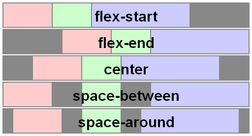
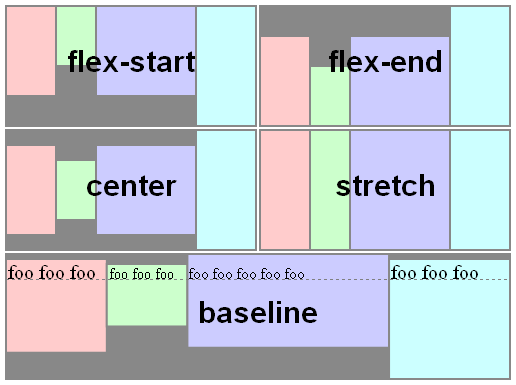

# Exercise 2 - Sizing and the box model
This exercise will focus on the sizing and box model of CSS, which will be important knowledge to have before devling into layouts.

You will learn about:
- Display properties
- Normal flow vs out of flow (float, abolute/fixed positioning)
- Understanding how the box model affects sizing of elements

## Display properties
The display property plays an important role in CSS, it decides how an HTML-element will behave in relation to other elements.
In this exercise we will take a look at the most important display properties; inline, inline-block, block, flex and grid.
For full details of display properties check out: [Display properties](https://developer.mozilla.org/en-US/docs/Web/CSS/display)

### inline
`display: inline` will make an element behave as an inline element (like <span>). Any height and width properties will have no effect to it. Text and icons are common uses for display: inline.

### inline-block
`display: inline-block` will make an element display as an inline-level block container. The element itself is formatted as an inline element, but you can apply height and width values. Uses for inline-block can be pretty much anything that you want to not take up all available space and control the size of.

### block
`display: block` The block element will take up all horizontal space in the parent container, it will allways start on a new line from previous elements and stretch to the end of what confines it

### flex
Check out this overview for a more detailed explanation of flexbox: [Flexbox concepts](https://developer.mozilla.org/en-US/docs/Web/CSS/CSS_Flexible_Box_Layout/Basic_Concepts_of_Flexbox)
Flexbox is a bit more complicated than the previous displays, putting `display: flex` on a container makes the children elements flex dynamically when the parent container is resized, essentially the elements are stretching and moving either in a row or in a column configuration, imagine a musician playing an accordion. The flex container can have 6 different properties:

### flex-direction
Flex-direction decides which direction the children elements are flexing. `row` makes the elements flex horizontally `row-reverse` reverses the order of the items in horizontal view, `column` makes the elements spread out vertically, and `column-reverse` will do the same just backwards.

Default flex-direction is set to "row", so if you want a collection of items to spread out vertically you type it like this:
```css
 .main-content {
  display: flex;
  flex-direction: column;
 }
```
### flex-wrap
The default value for `flex-wrap` is set to no-wrap, this is so that items can behave as described above, like an accordion. Setting the value to wrap will make the HTML-elements "jump" to the next line if the parent container shrinks.

### flex-flow
`flex-flow` is a shorthand property for setting both `flex-wrap` and `flex-direction`.
```css
 .main-content {
   display: flex;
   flex-flow: row wrap;
 }
 /* is the same as */ 
 .main-content {
   display: flex;
   flex-direction: row;
   flex-wrap: wrap;
 }
```
### justify-content

Using `justify-content` can control the white-space between flexing items and their parent container. The different values are; `center`, `flex-start`(default), `flex-end`, `space-around`, `space-between`.

```css 
 .main-content {
  display: flex;
  justify-content: flex-end; 
  /* this will push all children elements to the right side of the parent container if there is available space */
 }
```

```css 
 .main-content {
  display: flex;
  flex-direction: reverse-row;
  justify-content: center; 
  /* this will make all child elements flex in reverse order and be centered in the parent container */
 }
```

### align-items

`align-items` property sets the align-self value on all direct children as a group. The `align-self` property sets the alignment of an item within its containing block.

If `flex-direction` is row and `align-items` is set to flex-start, the items will attach to the top of the container, if `flex-direction` is set to column however, flex-start


### align-content


### grid

### None

## Flow

## The Box model


