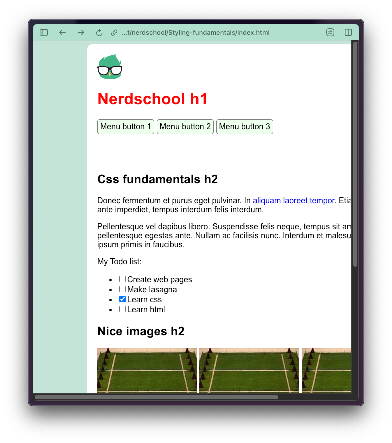
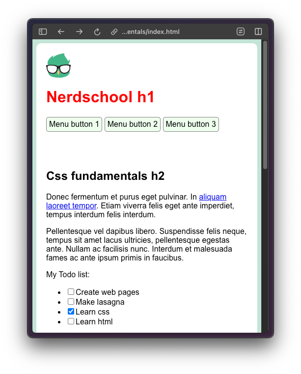
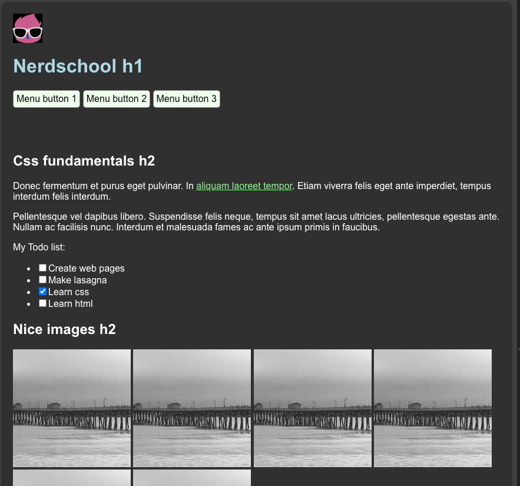

# Exercise 3 - Making it responsive with media queries

Media query is a CSS technique introduced in CSS3.
It uses the @media rule to apply CSS properties only if a certain condition is true.
To use a mediaquery simply make a new css rule with the @media tag followed by only screen and a breakpoint. It is common to use the screen width as breakpoints either through min-width or max-width, but you can also trigger it through other properties such as (orientation: landscape) if you are on mobile and flip the device over.

In the example code below, the background color of the body will change to red when the min-width of the window is 600px. This means that resizing the browser window will give the webpage a different look depending on the size of the window.

```css
@media only screen and (min-width: 600px) {
  body {
    background-color: red;
  }
}
```

We can use @media to our advantage when desiging webpages for mobile. We type whatever css rules we want in the media query that we want to override previous rules.
In the example below you can see that we set the body width to 100% when the screen width is at max 600px, this will make the body fill the entire width of the browser window. When the screen width is 601px minimum we set the width to 800px and margin: 0px auto, making it so that it will be a set size of 800px and be centered in the window due to the margin rule.

```css
@media only screen and (max-width: 600px) {
  body {
    width: 100%;
  }
}

@media only screen and (min-width: 601px) {
  body {
    width: 800px;
    margin: 0px auto;
  }
}
```

There are a number of different breakpoint configurations that is possible, it all depends on what your target devices are. But it is common to set mobile size from around 400-800px, tablet from 800-1000px and desktop from around 1000 and up. Some websites have breakpoints at larger sizes than that, in order to support 4k screens for example.

## :pencil2: Media queries Tasks

#### Task 1 - Mobile friendly

Try to resize your browser window until it is about 800 pixels wide, emulating how the page may look on a mobile phone. 
Notice that you get a horizontal scroll bar, because we set the width and margin of the `container` element. 




Make sure the container gets a margin and a fixed width *only* if the screen is at least 900 pixels wide. 

The result should look something like this: 



#### Task 2 - Dark mode 

There is a media query for detecting if the user prefers dark mode or light mode, called `prefers-color-scheme`. 
Use this to make the background dark and the text light. 

- Change the color of the headings to `lightblue`
- Set the background to a dark color
- Set the text to a light color
- Invert the colors in the logo, making the owl wear dark sunglasses.

The result should look something like this: 


Resources: 
- [Toggle dark mode in developer tools](https://stackoverflow.com/questions/57606960/how-can-i-emulate-prefers-color-scheme-media-query-in-chrome)
- [CSS Media query for dark mode](https://developer.mozilla.org/en-US/docs/Web/CSS/@media/prefers-color-scheme)
- [CSS Filter invert](https://developer.mozilla.org/en-US/docs/Web/CSS/filter-function/invert)


