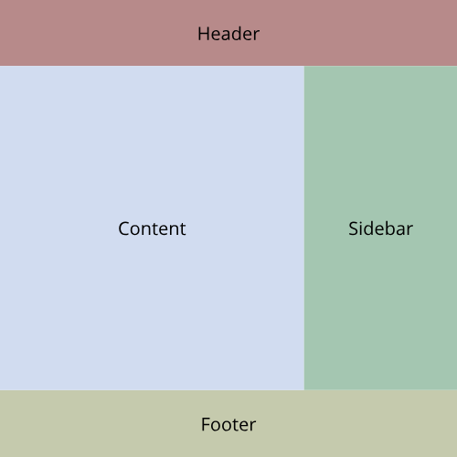
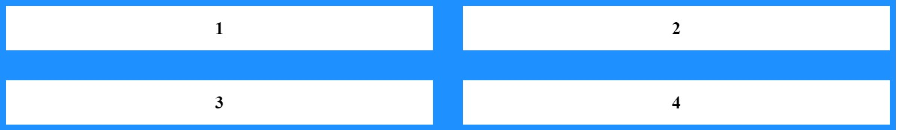
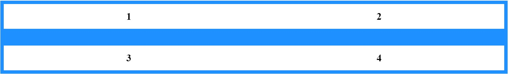

# Exercise 3 - Layout using grid

The grid layout property is a grid-based layout system in which you can use columns and rows to define webpages instead of having to use floats and positioning.

Grids are a fairly new css property, but is now possible to use in the most up to date browsers (Chrome, Firefox, Safari and Edge). Internet Explorer only has partial support so if you are designing a website that needs to work i IE you need to be careful using the new grid properties. [Can I use](https://caniuse.com/) offers an overview of the support:

<a href="http://caniuse.com/#feat=css-grid">
<picture>
<source type="image/webp" srcset="https://caniuse.bitsofco.de/image/css-grid.webp">

</picture>
</a>

A grid layout consists of one parent element where the `display: grid` needs to be set. It will then affect all immediate children of the parent:

```html
<div class="grid-parent">
  <div class="grid-child">Child 1</div>
  <div class="grid-child">Child 2</div>
  <div class="grid-child">Child 3</div>
  <div class="grid-child">Child 4</div>
  <div class="grid-child">Child 5</div>
  <div class="grid-child">Child 6</div>
</div>
```

With some grid styling:

```css
.grid-parent {
  display: grid;
  grid-template-columns: repeat(3, 1fr);
  background-color: dodgerblue;
  padding: 10px;
  gap: 10px;
}

.grid-child {
  background: white;
  text-align: center;
  padding: 20px;
}
```

It will look like this:


:exclamation: Only immediate children will be a part of the grid.

```html
<div class="grid-parent">
  <div class="grid-child">Child 1</div>
  <div class="grid-child">Child 2</div>
  <div class="grid-child">
    Child 3
    <div class="not-a-grid-child">Not a grid-child</div>
  </div>
  <div class="grid-child">Child 4</div>
  <div class="grid-child">Child 5</div>
  <div class="grid-child">Child 6</div>
</div>
```


Note that the "Not a grid-child" is placed inside the child 3 grid-item, and does not get affected by the `display: grid`.

## Grid template

As you might have noticed in the grid-css earlier there is more grid-properties than just `display: grid` and `grid-template` is one of them.

### Grid-template-columns

With `grid-template-columns` you define the size of each grid column. In the css above `repeat(3, 1fr)` means that there will be 3 columns per row where each grid-child gets 1/3 of the available space.

You can use a range of different sizing options when defining template columns e.g:

```css
grid-template-columns: 100px 1fr 50% min-content max-content;
```


- 100px is a set pixel value
- 1fr is a fraction unit
- 50% is a percentage size based on the witdh of the parent
- min-content is the minimum size the element needs to not to cause overflow
- max-content is the elements ideal size given infinite available space

### Grid-template-rows

`grid-template-rows` works in the same way as columns.

### Grid-template-area

`grid-template-areas` gives us a way to name each area in our grid layout. Notice the `grid-template-area` property on the parent and the `grid-area` on child elements:

```html
<div class="grid-parent">
  <div class="grid-child grid-child-1">1</div>
  <div class="grid-child grid-child-2">2</div>
  <div class="grid-child grid-child-3">3</div>
  <div class="grid-child grid-child-4">4</div>
</div>
```

```css
.grid-parent {
  display: grid;
  grid-template-columns: repeat(2, 1fr);
  grid-template-areas:
    "one two"
    "three four";
  background-color: dodgerblue;
  padding: 10px;
  gap: 10px;
}

.grid-child {
  background: white;
  text-align: center;
  padding: 20px;
  font-weight: 600;
  font-size: 30px;
}

.grid-child-1 {
  grid-area: one;
}

.grid-child-2 {
  grid-area: two;
}

.grid-child-3 {
  grid-area: three;
}

.grid-child-4 {
  grid-area: four;
}
```

.

Here each child has gotten it's own grid-area name and the parent can use these names in the `grid-template-area` to set them up. By changing that property you can change the entire layout:

```css
grid-template-columns: repeat(3, 1fr);
grid-template-areas:
  "one one three"
  "two four four";
```

Will give the following layout:
.

This means we can use css to rearrange the order of the children without changing the HTML! This is especially useful if you need to change your layout on smaller devices.

## :pencil2: Task 1 - Grid layout

:exclamation: In this exercise edit the code in this editor: [Grid task](https://codepen.io/grynag/pen/XWWBWww)
Solution can be found here: [Grid task 1 solution](https://codepen.io/grynag/pen/abbjzYZ)
Remember to ask if you are stuck on these tasks, also [MDN](https://developer.mozilla.org/en-US/docs/Web/CSS) is a good resource.

### Task 1.1 Name all areas

Give the header, content, footer and sidebar the `grid-area:` property and give them names.

### Task 1.2 Setup the grid template areas

Setup the `grid-tempate-areas` on the parent to make the following layout:

:question: How do you get the content 2x the size of the sidebar?



## Grid gap

The `gap` property can be used to add spacing between grid elements. You can specify gap between rows by using `row-gap`, between columns with `column-gap` and between both with just `gap`.

`gap`


`row-gap`


`column-gap`


## :pencil2: Task 2 - Grid inside the grid

:exclamation: You can either use the your solution from Task 1 to move forward or use the given solution [Grid task 1 solution](https://codepen.io/grynag/pen/BaaPyxO)  
Solution can be found here: [Grid task 2 solution](https://codepen.io/taranger/pen/drjYGq)

### Task 2.1 Grid the content

:book: A card is commonly used name for elevated boxes with content

Our cards with text and kitten pictures looks a bit sad. To fix this, set up a new grid inside the grid.
The cards live inside the `<div class="content"></div>` so that will make our new grid parent. You should try to make it look something like this:

:question: Do you need to use grid-areas here, or could you solve this differently than the main layout?
:question: How do you get the same spacing between each card, but not on the outside?


### Task 2.2 Center the card with flexbox

By using the knowledge you obtained in the previous task, center the card content by using flexbox.

### [Go to exercise 4 :arrow_right:](../exercise-4/readme.md)
